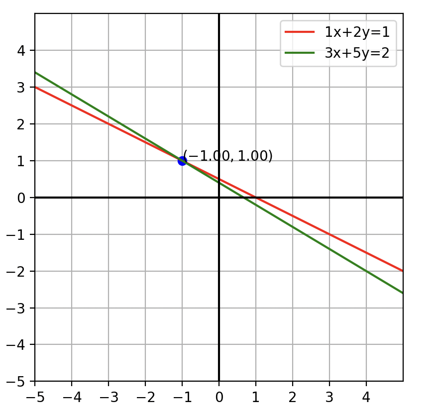

# System 2 x 2
Solves a 2x2 system and graph the solution using matplotlib. Simply change the constant on top of file to solve a different system and adjust the x and y min-max range for graphing.

>python3 system2x2

